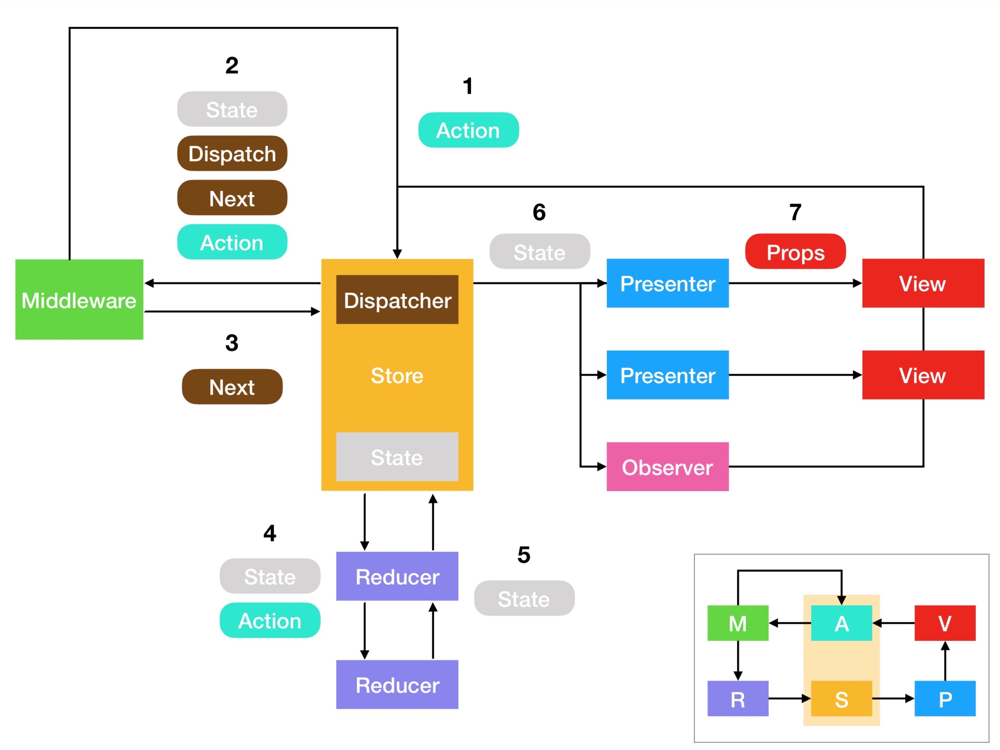

# Swifty Redux 
[](https://travis-ci.com/a-voronov/swifty-redux)

Swift implementation of [Redux](https://redux.js.org)

# About

SwiftyRedux tries to stay as close to Redux.js with its ideas and API as possible. 
It should be easier to use this tool and understand approach within iOS platform by sharing same vocabulary and having such a great community in js world! There will be minor differences though due to the languages and platforms distinctions.

SwiftyRedux has few core components:

* **State** is a single data structure. It is a source of truth of our application. Store can be a struct or enum, it may contain other structs or enums as properties. Often it is a deeply nested object that describes your whole application state. Keep in mind that state should be easily serialized and deserialized, thus not contain any behavior. State is managed by the store.

* **Store** is a place that contains state. It also allows subscribing to the state changes and dispatching actions to change its state. There's only single store in the whole Redux application.

* **Action** is a plain object that represents an intention to change the state. Actions should not contain any behavior. All actions should conform to the empty `Action` protocol. The only way to change state is through action that will be 

* **Reducer** is the only place that can change the state based on the current state and an acion. Reducers must be pure functions - functions that return the exact same output for given inputs, thus not performing any side effects. It makes them easy to test and reason about the logic that affects global application state. Store is responsible for delivering actions to the reducers and updating state with their results.

* **Middleware** is a place where you keep async logic and side effects. It's the best way to connect IO with pure unidirectional flow application. They intercept actions after they were dispatched and before they reached reducers, but you can design your middlewares in such a way they don't slow down delivery of actions to the reducers.

Please refer to https://redux.js.org/introduction/getting-started for more info about this approach in general and Redux.js community experience.

# Flow Diagram



Usually your flow will match current diagram:

 1. You dispatch an Action via the Store.
 1. Action travels to the Middleware.
 1. Middlewares might dispatch a new Action (which will travel all they way from the very beginning) or propagates it further.
 1. Reducers receives the Action and the current State.
 1. They might apply the Action to the State to return a New State, or return a Current State if no changes required.
 1. After the state was changed, any Observers will receive it.
 1. In case of UI observers, Presenters can transform state or its parts into Props and give it to their Views to render.
 1. Any user action or program events can be turned into Actions and will be dispatched to the Store to start this cycle from the beginning.

# Installation

## CocoaPods

You can install SwiftyRedux via [CocoaPods](https://cocoapods.org) by adding it to your Podfile:
```
pod 'SwiftyRedux'
```
And running `pod install`.

## Carthage

TBD

## Swift Package Manager

TBD

## Playground

There's also a Playground, so you can play around with SwiftyRedux. In order to start using it:

 1. Open `Example/SwiftyRedux.xcworkspace`.
 1. Build `SwiftyRedux-Example` scheme.
 1. Finally open the `Example/SwiftyRedux.playground`.
 1. Choose `View > Show Debug Area`.

# Project Structure

SwiftyRedux is trying to be as minimalistic at its Core as possible, yet still open for extensions on top of it.    
Here are components included in this repo:

## ⚙️ Core 
Core is the basic component and contains minimal needed functionality to enjoy SwiftyRedux :)    
Such as `Action`, `Reducer`, `Middlerware`, `Store` and `Disposable`.
```
pod 'SwiftyRedux/Core'
```

## 💊 Steroids 
Steroids is the extension that provides declarative API to transform state updates coming from the store. Its `Observable` and `ObservableProducer` abstractions look and behave similar to [ReactiveSwift](https://github.com/ReactiveCocoa/ReactiveSwift) `Signal` and `SignalProducer`.    
```
pod 'SwiftyRedux/Steroids'
```

## 🚌 BatchedActions
Batched Actions provide ability to send multiple actions at once and split them into single actions either with upgraded reducer or own middleware (not both though). Inspired by [redux-batched-actions](https://github.com/tshelburne/redux-batched-actions).
```
pod 'SwiftyRedux/BatchedActions'
```

## 💥 SideEffects
Side effects is a kind of middleware that is run **after** reducers have received and processed the action, so that, they can't "swallow" or delay it. Inspired by [redux-observable](https://redux-observable.js.org).[Epics](https://redux-observable.js.org/docs/basics/Epics.html) but this is an "imperative" epics.
```
pod 'SwiftyRedux/SideEffects'
```

## 📦 Command
Commands are simple wrappers over functions that contain additional callee meta information for easier debugging.
```
pod 'SwiftyRedux/Command'
```

## 🚀 Epics
Actually epics implementation close to [redux-observable](https://redux-observable.js.org).[Epics](https://redux-observable.js.org/docs/basics/Epics.html) but without fancy functionality like adding epics asynchronously/lazily.
It is powered by ReactiveSwift to provide full reactive experience while transforming actions.
```
pod 'SwiftyRedux/Epics'
```

## 🌉 ReactiveExtensions
Bridge between ReactiveSwift and SwiftyRedux: `Observable` <> `Signal`, `ObservableProducer` <> `SignalProducer`.
This one depends on ReactiveSwift and Steroids.

## 🎨 Mix them together!

All of these components already have **Core** as their dependecy, thus you can install any of them as shown above.    
You can also mix any of them together and install many at once, i.e.:
```
pod 'SwiftyRedux', :subspecs => ['Core', 'Steroids', 'SideEffects', 'BatchedActions']
```

# Example project

TBD

# License

SwiftyRedux is available under the MIT license. See the [LICENSE](LICENSE) file for more info.
